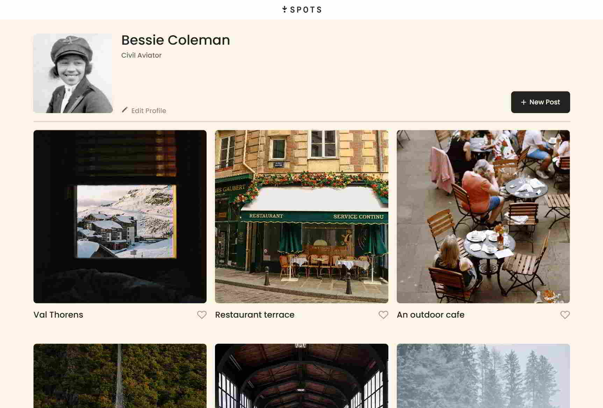
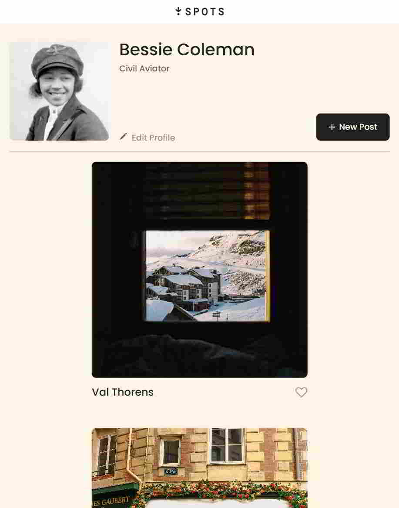
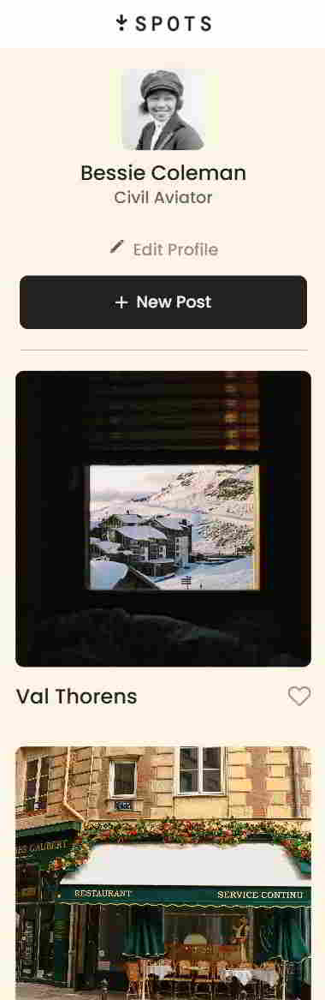

# Spots - Interactive Social Media Web Application

## 📖 Description

**Spots** is an interactive social media web application where users can:

- Add and remove photos.
- Like photos shared by other users.
- Edit their profile information.

This project implements responsive design principles to provide a seamless experience across devices, including desktop, tablet, and mobile.

---

## 🌟 Features

- **Responsive Design**: The layout dynamically adjusts for desktop, tablet, and mobile views.
- **Profile Customization**: Users can update their avatar and profile details.
- **Interactive Cards**: Users can like and manage photo cards.
- **Dynamic Grid Layout**: The number of cards per row adapts to the screen size.
- **Overflow Handling**: Long text is truncated with ellipses for a cleaner UI.

---

## 🛠️ Technologies and Techniques Used

- **HTML5**: Semantic tags for accessible and SEO-friendly content.
- **CSS3**: Flexbox, Grid, and media queries for responsive design.
- **JavaScript**: Interactivity and dynamic DOM manipulation.
- **BEM Methodology**: Organized and reusable CSS classes.
- **GitHub Pages**: Deployment for showcasing the project.
- **Normalize.css**: Cross-browser consistency.
- **Figma**: Design reference for building the layout.

---

## 📐 Design

- **Desktop**: Maximum width of 1440px with a 3-column card layout.
- **Tablet**: 2-column card layout with adjusted margins and spacing.
- **Mobile**: Single-column layout with optimized text and button sizes.
- **Typography**: Fonts from the Poppins family, styled for readability.

**Figma**

- [Link to the project on Figma](https://www.figma.com/file/BBNm2bC3lj8QQMHlnqRsga/Sprint-3-Project-%E2%80%94-Spots?type=design&node-id=2%3A60&mode=design&t=afgNFybdorZO6cQo-1)

---

## 🌍 Deployment

View the live project here: [Spots Web Application](https://rayyanzahid.github.io/se_project_spots/)

---

## 📸 Screenshots

### Desktop View





### Mobile View



---

## 📽️ Video Walkthrough

Watch a detailed walkthrough of the project: [Video Link](https://www.loom.com/share/6561c09550bf4615acb46296e97eefc3?sid=b0e63778-d074-4259-a46b-7cec8c2c5337)

---

## 🧩 Challenges & Learnings

### Challenges

- Implementing a fully responsive grid layout for cards.
- Handling text overflow for long content without breaking the design.
- Ensuring cross-browser compatibility.

### Learnings

- Deepened understanding of Flexbox and Grid for layout design.
- Improved skills in responsive design with media queries.
- Enhanced proficiency in the BEM methodology for CSS organization.

---

## 🚀 How to Run the Project

1. Clone the repository:
   ```bash
   git clone https://github.com/rayyanzahid/se_project_spots.git
   ```
